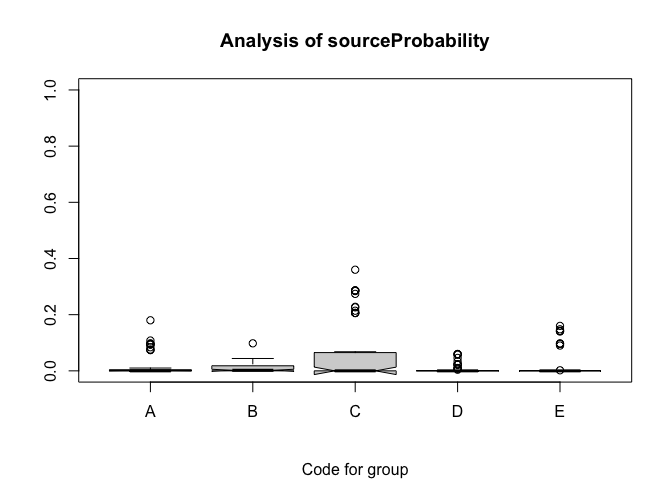

<!-- README.md is generated from README.Rmd. Please edit that file -->

# predictSource

The package predictSource provides functions to verify that data can be
used to separate sources of samples, to predict the sources of
additional samples, and to create plots that evaluate the validity of
the predictions. Data can be both quantitative and qualitative. A
proposed analysis strategy is to use random forests to evaluate whether
the data can separate the sources and to identify the most important
predictors if there are many, use a classification tree to understand
how the data are used to separate sources, use random forests to predict
the sources of unknown samples, and then evaluate the validity of the
predictions by ploting the first two principal components of the
unknowns with the convex hulls of the known sources. The random forest
analysis also produces the probabilities of assignment to each source
for each sample; this can be helpful in identifying unknowns that are
difficult to classify.The package also contains functions for
exploratory data analysis (descriptive statistics, 2- and 3-dimensional
plots \[the latter can be rotated\], tests for 1- and 2-dimensional
Gaussian distributions \[helpful in identifying outliers\]) and
multivariate analysis (principal components). A detailed vignette
provides examples for the use of each function (using obsidian data in
the examples) and some background for classification trees, random
forests, and checking for Gaussian distributions.

The motivation for the package was predicting the sources of obsidian
artifacts. Archaeologists and geochemists usually do this using 2- and
3-dimensional scatterplots. The functions in this package make
predictions much faster than can be done with scatterplots; the
principal components graphic identifies objects that are or may be
misclassified. Archaeological knowledge should also be used in making
predictions.

The figure below shows principal components plots using data sets with
the composition of five elements from five obsidian sources and the
predicted sources of 91 artifacts, with predictions made from
scatterplots (see the vignette for information about these data sets).
The left-hand plot shows the convex hulls of the first two principal
components from the source data. The second plot shows the locations of
artifacts that are outside of their respective predicted source convex
hulls. That plot clearly identifies one misclassified artifact
(predicted to be from source D but inside the convex hull for source C);
the remaining artifacts appear to be correctly classified. For these
data, the random forests predictions appear to be correct for all of the
artifacts.

``` r
library(predictSource)
data(ObsidianSources)
data(ObsidianArtifacts)
analyticVars <- c("Rb", "Sr", "Y", "Zr", "Nb")
sources <- unique(ObsidianSources[, "Code"])
pcaEval <-
  ps_pcaEvaluation(
    SourceData = ObsidianSources,
    unknownData = ObsidianArtifacts,
    SourceGroup = "Code",
    unknownGroup = "Code",
    known_sources = sources,
    predicted_sources = sources,
    AnalyticVars = analyticVars,
    ID = "ID",
    plotAllPoints = TRUE,
    plotHullsOutsidePoints = TRUE,
    plotOutsidePoints = TRUE
  )
```

<div class="figure">


<p class="caption">
Principal components plot with Jemez obsidian source convex hulls and
obsidian artifacts with points outside the convex hull labeled with
source predictions based on scatterplots.
</p>

</div>

The figure below is from a random forests analysis of the artifacts. The
figure contains box plots of the source assignment probabilities for
each artifact, excluding the probabilities of assignment to the
predicted source. This plot identifies the artifacts for which
assignment is most difficult. Source C is potentially of most concern.
The user can create a data frame with information on artifacts that may
be most likely to be misclassified. See the vignette for more details.

``` r
library(predictSource)
data(ObsidianSources)
data(ObsidianArtifacts)
analyticVars <- c("Rb", "Sr", "Y", "Zr", "Nb")
saveRandomForest <-
  ps_randomForest(
    data = ObsidianSources,
    GroupVar = "Code",
    Groups = "All",
    AnalyticVars = analyticVars,
    NvarUsed = 3,
    plotErrorRate = FALSE,
    plotImportance = FALSE,
    predictSources = TRUE,
    predictData = ObsidianArtifacts,
    plotSourceProbs = TRUE
  )
#> Warning in (function (z, notch = FALSE, width = NULL, varwidth = FALSE, : some
#> notches went outside hinges ('box'): maybe set notch=FALSE
#> Warning in (function (z, notch = FALSE, width = NULL, varwidth = FALSE, : some
#> notches went outside hinges ('box'): maybe set notch=FALSE
```

<div class="figure">


<p class="caption">
Figure 7.3b: Box plots of the estimated probabilities of sources other
than the predicted sources for the obsidian artifacts.
</p>

</div>

## Installation

You can install predictSource from GitHub with:

``` r
# install.packages("devtools")
devtools::install_github("benmarwick/predictSource")
```
